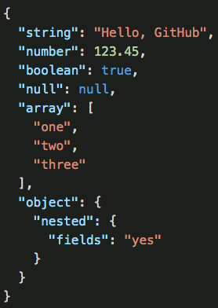

# react-jason

[](https://www.npmjs.com/package/react-jason)[](https://bundlephobia.com/result?p=react-jason)

Render syntax-highlighted JSON data using React. Lightweight.

Yes, the name is [intentional](#whats-with-the-name) ;)

## Installation

```
npm install --save react-jason
```

## Usage

```js
import {ReactJason} from 'react-jason'

const jsonData = {
  type: 'author',
  age: 34,
  primaryGenre: null,
  hasPublished: true,
  tags: ['sci-fi', 'fantasy'],
  image: {
    url: 'https://some.url/img.png',
  },
}

export function YourComponent() {
  return <ReactJason value={jsonData} />
}
```

## Theming/styling

We bundle a few different themes, and defining your own styles is actually very simple. The bundled themes are the following:

- An old hope classic - default (`anOldHopeClassic`)
- GitHub (`github`)
- Monokai (`monokai`)
- Monokai Sublime (`monokaiSublime`)
- VS Code Dark (`vscodeDark`)
- VS Code Light (`vscodeLight`)

To use them, import them from `react-jason/themes`:

```js
import {ReactJason} from 'react-jason'
import {github} from 'react-jason/themes'

const jsonData = {
  /* ... */
}

export function YourComponent() {
  return <ReactJason value={jsonData} theme={github} />
}
```

To specify your own styles, specify a `theme` object with either a `classes` object or a `styles` object (or both). The keys represent the different node types. See [src/themes/monokai.ts](an existing theme) to figure out the available types.

## Props

- `value`: _any_ - The JSON data to render. This is the only required property.
- `quoteAttributes`: _boolean_ - Whether or not to quote attributes (JSON-style) or remove them where they are not needed (like in javascript). Default is `true`.
- `theme`: _object_ - See theming/styling section above.

## Switching theme on dark/light mode

```js
import {ReactJason} from 'react-jason'
import {vscodeLight, vscodeDark} from 'react-jason/themes'

const jsonData = {
  /* ... */
}

export function YourComponent() {
  const prefersDarkMode =
    typeof window !== 'undefined' && typeof window.matchMedia === 'function'
      ? window.matchMedia('(prefers-color-scheme: dark)').matches
      : false // use light theme by default?

  const theme = prefersDarkMode ? vscodeDark : vscodeLight

  return <ReactJason value={jsonData} theme={theme} />
}
```

## What's with the name?

react-json was taken 🤷

## License

MIT © [Espen Hovlandsdal](https://espen.codes/)
